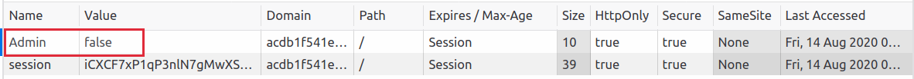

# Authorization Testing

# I. Testing for Privilege Escalation
## 1. Vertical privilege escalation
Nếu một user có thể truy cập các chức năng mà lẽ ra họ không được phép truy cập, đó được gọi là **vertical privilege escalation**. Chẳng hạn, nếu một standard user có thể truy cập
vào trang admin nơi có thể thực hiện thao tác xóa một tài khoản khác, thì đó được gọi là **vertical privilege escalation**.

### a. Các chức năng không được bảo vệ
#### Giới thiệu
Đây là một dạng tấn công vô cùng đơn giản dựa trên việc ứng dụng không hề có phương pháp bảo vệ nào đối với các chức năng nhạy cảm. Do đó với bất kì user nào cũng có thể truy cập và sử dụng tính năng đó mà không cần quyền admin, chỉ cần có link tới trang đó. Các tính năng quan trọng có thể bị lộ bằng các cách khai thác sau: 
* Khai thác file robots.txt
* Brute force danh sách các endpoint để tìm ra các tính năng ẩn.
* Để lộ URL đến các chức năng nhạy cảm trong source code
#### Demo
##### *Ví dụ 1: Unprotected admin functionality*
* Lab: https://portswigger.net/web-security/access-control/lab-unprotected-admin-functionality
* *Đề: Trang admin panel không được bảo vệ. Giải lab bằng cách truy cập vào trang này và xóa user `carlos`.*
* Cách 1: Khai thác thông tin file robots.txt
	* Truy cập vào trang robots.txt: Phần nội dung chứa liên kết tới trang admin panel

	* Truy cập trang admin panel và xóa user `carlos`

* Cách 2: Brute force danh sách các endpoint 
	* Sử dụng tool dirsearch với URL là trang home của target. Tìm ra được trang admin panel

##### *Ví dụ 2: Unprotected admin functionality with unpredictable URL*
* Lab: https://portswigger.net/web-security/access-control/lab-unprotected-admin-functionality-with-unpredictable-url
* *Đề: Bài lab này không có bất kì phương pháp bảo vệ nào đối với trang admin panel. Trang admin panel rất khó đoán, tuy nhiên thì trang này lại bị để lộ tại một nơi nào đó trong ứng dụng. Giải bài lab này bằng cách truy cập admin panel và xóa user `carlos`*
* Xem source code, ta thấy một thông tin đáng chú ý: Có một script đang xét user có phải là admin hay không để tạo một reference vào trang admin panel:

* Truy cập vào trang đó và xóa user `carlos`

### b. Parameter-based access control methods
#### Giới thiệu
Một vài ứng dụng xác định quyền hạn/ vai trò của user khi đăng nhập và sau đó lưu trữ thông tin tại nơi mà user có khả năng chỉnh sửa như các trường ẩn, cookie, hoặc là đặt ngay query string parameter. Các bước tiếp theo ứng dụng sẽ quyết định về quyền hạn truy cập dựa trên các giá trị được user submit. Về cơ bản phương pháp này không an toàn bởi vì user có thể dễ dàng thay đổi giá trị và đạt được sự truy cập vào các tính năng mà user này không có quyền sử dụng, chẳng hạn như các chức năng quản trị.
#### Demo
##### *Ví dụ 1: User role controlled by request parameter*
* Lab: https://portswigger.net/web-security/access-control/lab-user-role-controlled-by-request-parameter
* *Đề: Trang admin panel sẽ được đặt tại endpoint /admin, nơi mà xác định có phải là admin hay không thông qua việc sử dụng cookie. Giải bài lab này bằng cách truy cập vào admin panel và sử dụng chúng để xóa tài khoản `carlos`. Credential tài khoản của bạn là `wiener:peter`*. 
* Theo gợi ý, ta sẽ sử dụng credential để đăng nhập vào tài khoản của user `wiener`:

* Xem cookie, ta thấy có thể chỉnh sửa cookie để chuyển sang quyền admin. Modify value của trường admin từ `false` thành `true`

* Refresh lại trang sau khi modify cookie, ta thấy có reference tới trang admin panel

* Delete user `carlos` tại trang admin panel

##### *Ví dụ 2: User role can be modified in user profile*
* Lab: https://portswigger.net/web-security/access-control/lab-user-role-can-be-modified-in-user-profile
* *Đề: Bài lab này có trang admin panel tại endpoint /admin. Nó chỉ có thể truy cập bởi user có trường `roleid` là 2. Giải bài lab này bằng cách truy cập admin panel và xóa tài khoản `carlos`. Bạn có thể đăng nhập vào tài khoản của một standard user với credential như sau: `wiener:peter`*.
* Đầu tiên ta sẽ đi tìm trang có thể cho phép ta modify thông tin user hoặc các vị trí cho phép ta gửi các POST Request. Ta xác định được vị trí đó là trang My Account, cho phép ta update email. Thử update email để xem cấu trúc của gói tin POST Request gửi lên Server để Update Profile user `wiener`:

* Ta phát hiện trong gói tin trả về có trường roleid. Do đó ta có thể lợi dụng để modify User Profile của user `wiener` khiến cho user này có vai trò admin.

* Sau hành động này, user `wiener` đã trở thành user có quyền admin. Truy cập vào trang admin panel và xóa user `carlos`.

## c. Broken access control resulting from platform misconfiguration
### Giới thiệu
* Một vài ứng dụng thực thi việc kiểm soát truy cập vào nền tảng bởi việc hạn chế truy cập vào các URL và phương thức HTTP cụ thể dựa trên vai trò của user. 
* Nhiều framework hỗ trợ một vài header non-standard mà có thể được sử dụng để ghi đè vào URL tại các gói tin Request gốc, chẳng hạn `X-Original-URL` và `X-Rewrite-URL`. Nếu website kiểm soát nghiêm ngặt tại front-end để hạn chế sự truy cập dựa trên các URL, nhưng ứng dụng lại cho phép ghi đè thông qua header của gói tin request, nó có thể gây ra lỗi bypass việc kiểm soát truy cập.
### Demo
#### *Ví dụ 1: URL-based access control can be circumvented*
* Lab: https://portswigger.net/web-security/access-control/lab-url-based-access-control-can-be-circumvented
* *Đề: Website này không xác thực admin panel tại trang /admin, nhưng hệ thống front-end được cấu hình để chặn các truy cập từ bên ngoài đến đường dẫn. Tuy nhiên, ứng dụng back-end được xây dựng sẵn trong framework để hỗ trợ `X-Original-URL` header. Để giải bài lab này, truy cập vào admin panel và xóa user `carlos`*
* Truy cập bằng standard user vào endpoint /admin, ta thấy truy cập bị từ chối.

* Sử dụng header `X-Original-URL` gửi kèm trong gói tin GET Request gửi lên server để ghi đè vào, ta có thể truy cập trang admin panel:

* Xóa user `carlos` bằng cách gửi một POST Request lên server:

## 2. Horizontal privilege escalation
### Giới thiệu
Horizontal privilege escalation phát sinh khi một user có thể truy cập vào các nguồn tài nguyên cùng loại nhưng thuộc về một user khác. Ví dụ như một nhân viên chỉ nên có thể truy cập vào công việc và bảng lương của họ, nhưng họ có thể truy cập vào các record của người khác, đó là hành động Horizontal privilege escalation.
### Demo
#### *Ví dụ 1: User ID controlled by request parameter*
* Lab: https://portswigger.net/web-security/access-control/lab-user-id-controlled-by-request-parameter
* *Đề: Bài lab này làm về lỗ hổng horizontal privilege escalation trên trang My Account. Submit API key của user `carlos` để hoàn thành bài lab này. Tài khoản của bạn là `wiener:peter`*
* Một ví dụ đơn giản về việc thay đổi User ID để truy cập vào tài nguyên của người khác. Chuyển trường `id` từ `wiener` sang `carlos` để có thể xem được `API key` của user `carlos`

* Trong một số ứng dụng, giá trị của các parameter có thể không thể đoán được. Ví dụ thay vì sử dụng số theo thứ tự tăng dần hoặc tên của user, ứng dụng có thể sử dụng globally unique identifiers (GUID) để định danh người dùng. Do đó Attacker rất khó đoán được định danh của người dùng khác. Tuy nhiên có thể GUID thuộc về người dùng khác có thể bị lộ ở một nơi nào đó trong ứng dụng, có thể giúp cho việc tấn công Horizontal privilege escalation có thể xảy ra.
#### *Ví dụ 2: User ID controlled by request parameter, with unpredictable user IDs*
* Lab: https://portswigger.net/web-security/access-control/lab-user-id-controlled-by-request-parameter-with-unpredictable-user-ids
* *Đề: Bài lab này có lỗ hổng horizontal privilege escalation tại trang My Account, nhưng được định danh người dùng bởi GUID. Để giải bài lab này, tìm ra GUID cho user `carlos`, sau đó submit API Key của user này như kết quả. Tài khoản của bạn là ` wiener:peter`*
* Tại bài post số 3 - Procrastination, bài được viết bởi tác giả `carlos`. Ta có thể xem `userid` của user này bằng cách xem source code hoặc click vào tên tác giả.

* Sau khi có `userid` của `carlos`, ta có vào trang My Account để tiến hành các tấn công Horizontal privilege escalation:

* Ở một vài trường hợp, ứng dụng có thể detect khi user không được phép truy cập vào các tài nguyên, sẽ trả về redirect tới login page. Tuy nhiên, response chứa redirect vẫn có thể bao gồm một vài thông tin nhạy cảm thuộc về target user, do đó tấn công vẫn thành công.
#### *Ví dụ 3: User ID controlled by request parameter with data leakage in redirect*
* Lab: https://portswigger.net/web-security/access-control/lab-user-id-controlled-by-request-parameter-with-data-leakage-in-redirect
* *Đề: Bài lab này chứa đựng lỗ hổng kiểm soát truy cập khi các thông tin nhạy cảm bị lộ trong body của gói redirect response. Để giải bài lab này, submit API key đạt được của user `carlos`. Tài khoản của bạn là `wiener:peter`*
* `id` dễ đoán bởi việc chuyển từ `wiener` sang `carlos`. Tuy đã redirect sang trang /home, nhưng việc sử dụng function `header()` để redirect mà không có `exit()` hoặc `die()` thì chương trình sẽ vẫn thực thi đoạn code bên dưới, được trả về kèm trong gói tin redirect. (Do function `header()` mặc định sẽ trả về code 302: temporary redirect)
* Chuyển sang id của `carlos`

* Bị redirect sang trang home:

* Tuy nhiên thì thông tin My Account của user `carlos` vẫn tiếp tục được thực thi và hiển thị tại gói tin response redirect.

## 3. Horizontal to vertical privilege escalation
### Giới thiệu
Thông thường horizontal privilege escalation có thể sẽ trở thành vertical privilege escalation, bởi chúng tổn hại nhiều đặc quyền của user. Ví dụ rằng horizontal escalation cho phép attacker reset hoặc bắt được password thuộc về nhiều tài khoản khác. Nếu mục đích của attacker là administrator và có được các thông tin chẳng hạn password hoặc thay đổi password của admin theo ý của attacker, sau đó attacker có thể đạt được sự truy cập vào tài khoản quản trị và thực hiện được vertical privilege escalation.
### Demo
### *Ví dụ 1: User ID controlled by request parameter with password disclosure*
* Lab: https://portswigger.net/web-security/access-control/lab-user-id-controlled-by-request-parameter-with-password-disclosure
* *Đề: Bài lab này có trang thông tin chi tiết về tài khoản, bao gồm dạng password đã được điền trước tại một input bị che. Để giải bài lab, đạt được password của tài khoản admin và sau đó xóa user `carlos`. Tài khoản của bạn: `wiener:peter`*
* Đổi parameter `id` từ `wiener` sang `administrator` để thực hiện horizontal privilege escalation.

* Truy cập vào tài khoản admin bằng username và password có được, thực hiện xóa tài khoản `carlos`

# II. Insecure direct object references
## 1. Giới thiệu
Insecure Direct Object References xảy ra khi ứng dụng cung cấp sự truy cập trực tiếp vào các đối tượng dựa trên input của người dùng nhập vào. Kết quả là lỗ hổng này cho phép attacker có thể bypass authorization và truy cập vào các tài nguyên trực tiếp trong hệ thống, ví dụ các record trong database hoặc các file. Insecure Direct Object References được thực hiện bởi sự thay đổi giá trị của các parameter được sử dụng để trỏ đến trực tiếp các đối tượng. Nguyên nhân bởi vì các ứng dụng sử dụng input do người dùng nhập vào và dùng chúng để lấy các đối tượng mà không thực hiện các cơ chế kiểm soát truy cập một cách hiệu quả.
## 2. Demo
### *Ví dụ 1: Insecure direct object references*
* Lab: https://portswigger.net/web-security/access-control/lab-insecure-direct-object-references
* *Đề: Bài lab này lưu trữ dữ liệu log chat trực tiếp trên hệ thống file system và có thể lấy lại chúng bằng cách sử dụng URL tỉnh. Để giải bài lab này tìm password của user `carlos` và đăng nhập vào tài khoản của anh ấy*
* Khi ta chọn vào `live chat`, sẽ có nút `View transcript`. Điều đặc biệt là khi ta ấn bất kì lần nào thì số thứ tự của file text được download về đều bắt đầu từ 2 trở đi. Có lẻ trước đó đã có một cuộc hội thoại. Ta download cuộc hội thoại đầu tiên bằng cách gửi tới URL tỉnh lấy về file `1.txt`

* Và tìm được password của user `carlos` trong cuộc hội thoại này. Sử dụng password này đăng nhập vào tài khoản `carlos`.

### Access control vulnerabilities in multi-step processes
* Nhiều web site thực thi nhiều chức năng quan trọng thông qua một số bước. Nó thường có nhiều input hoặc nhiều sự lựa chọn, hoặc user cần xác nhận trước khi hành động được thực thi. Cho ví dụ như các chức năng quản trị để update thông tin chi tiết của user thường bao gồm các bước sau:
1. Tải form chứa chi tiết thông tin về user
2. Submit sự thay đổi
3. Review sự thay đổi và xác nhận.
Đôi khi một web site sẽ thực thi kiểm soát truy cập nghiêm ngặt thông qua một số bước nhưng phớt lờ tại một vài bước khác. Giả sử rằng kiểm soát truy cập chỉ được áp dụng tại bước thứ 1 và bước thứ 2, tuy nhiên không thực hiện với bước thứ 3. Website thì cho rằng user chỉ sẽ đạt được tới bước 3 khi hoàn thành các bước đầu tiên, nơi đã được kiểm soát hợp lý. Tại đây, attacker có thể đạt được các truy cập không được phép tới các chức năng bởi việc bỏ qua bước 1 bước 2 và trực tiếp submit request tại bước 3 với các param được yêu cầu.
#### *Ví dụ 2: Multi-step process with no access control on one step*
* Lab: https://portswigger.net/web-security/access-control/lab-multi-step-process-with-no-access-control-on-one-step
* *Đề: Bài lab này có trang admin panel với sự thiếu xót trong việc xử lý cho việc thay đổi vai trò của user. Bạn có thể làm quen với admin panel với việc sử dụng tài khoản: `administrator:admin`. Để giải bài lab, đăng nhập bằng cách sử dụng tài khoản `wiener:peter` và khai thác sự thiếu kiểm soát truy cập để biến tài khoản của chính mình thành tài khoản admin*
* Ở bài lab này khi gửi một request yêu cầu upgrade/downgrade một tài khoản thì luôn có một request yêu cầu xác nhận sự thay đổi đến trả về người gửi form. Nếu attacker bỏ qua bước 1, 2 và gửi kèm thêm parameter `confirmed=true` thì sẽ submit trực tiếp yêu cầu lên server. 
* Tải form chứa chi tiết thông tin về user và submit sự thay đổi:

* Review và xác nhận sự thay đổi:

* Dựa trên gói request cuối gửi lên server, ta có thể bỏ qua bước 1 và bước 2 để trực tiếp nâng đặc quyền của một tài khoản (Bằng việc thay sesion của gói request trên bằng session của user `wierner`):

