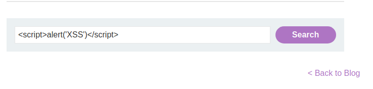

# Reflected cross-site Scripting
## Giới thiệu
* Reflected Cross-site Scripting (XSS) xảy ra khi attacker tiêm vào browser các đoạn code thực thi bên trong 1 HTTP response. Các câu được tiêm bởi attacker không được lưu trữ bên trong ứng dụng, chỉ tác động người dùng mở các link có chứa mã độc. Các chuỗi được sử dụng tấn công thường bao gồm một phần của các URI được làm thủ công hoặc là các paramter trong các gói HTTP, được xử lý không hợp lý bởi ứng dụng.

### *Ví dụ 1: Reflected XSS into HTML context with nothing encoded*
* Lab: https://portswigger.net/web-security/cross-site-scripting/reflected/lab-html-context-nothing-encoded
* *Đề: Bài lab chứa lỗ hổng Reflected XSS tại chứ năng tìm kiếm. Để giải bài lab, thực hiện XSS attack để gọi đến hàm `alert`*
* Do không có bất kì encode hay filter input do người dùng nhập nên ta có thể sử dụng đoạn script đơn giản: `` để thực hiện tấn công XSS.

* Hiển thị pop up:

